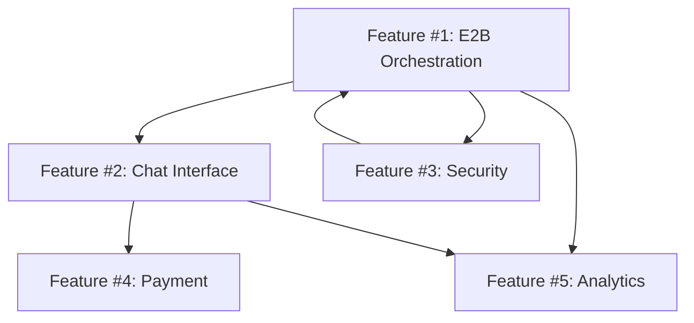

# Features Documentation

This directory contains detailed technical specifications for each major feature of SpawnAI.

## Structure

Each feature has its own directory with standardized documentation:

```
docs/features/
├── README.md                    # This file
├── feature-01-e2b-orchestration/
│   ├── SPEC.md                  # Technical specification
│   ├── IMPLEMENTATION.md        # Implementation details
│   └── TESTING.md              # Testing strategy
├── feature-02-chat-interface/
│   ├── SPEC.md
│   ├── IMPLEMENTATION.md
│   └── TESTING.md
└── ...
```

## Feature Documentation Standards

### SPEC.md Requirements
- **Problem Statement**: What problem does this feature solve?
- **Success Criteria**: How do we measure success?
- **Technical Requirements**: Detailed technical specifications
- **Dependencies**: What other features/services are required?
- **Constraints**: Technical limitations and considerations
- **API Contracts**: Request/response formats, WebSocket events
- **Security Considerations**: Security requirements and validations

### IMPLEMENTATION.md Requirements
- **Architecture**: High-level component design
- **Code Structure**: File organization and module breakdown
- **Key Functions**: Core function signatures and behaviors
- **Database Schema**: Data models and relationships (if applicable)
- **Configuration**: Environment variables and settings
- **Error Handling**: Error scenarios and recovery strategies

### TESTING.md Requirements
- **Unit Tests**: Component-level testing strategy
- **Integration Tests**: Cross-component testing approach
- **End-to-End Tests**: Full workflow testing scenarios
- **Performance Tests**: Load testing and benchmarks
- **Security Tests**: Vulnerability and penetration testing
- **Manual Testing**: Human verification scenarios

## Feature Priority Order

Based on the project backlog, features are prioritized as follows:

1. **Feature #1**: E2B Orchestration Engine (P0 - Critical Path)
2. **Feature #2**: Chat Interface & WebSocket Communication (P1)
3. **Feature #3**: Security & Code Validation (P0 - Parallel with #1)
4. **Feature #4**: Payment Integration (P1)
5. **Feature #5**: Analytics & Monitoring (P2)

## Development Workflow

1. **Design Phase**: Complete SPEC.md with stakeholder review
2. **Planning Phase**: Create IMPLEMENTATION.md with technical details
3. **Testing Strategy**: Define TESTING.md before coding begins
4. **Development**: Implement according to specifications
5. **Validation**: Execute testing strategy and verify success criteria
6. **Documentation**: Update docs with actual implementation details

## Cross-Feature Dependencies



This structure ensures each feature is properly specified, implemented, and tested before integration with other components.